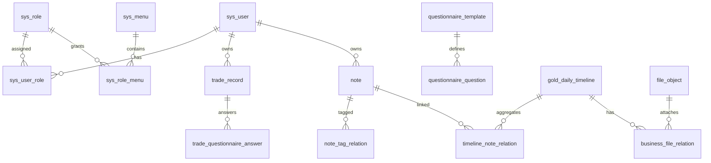

# TradN 项目阅读与业务总览

这份文档是面向开发者、运维人员和后续 AI 对话的入口，描述功能边界、代码位置、数据关系及运行约定。实现有变化时，先修改本文和 `BUSINESS_AND_DATABASE.md`，再修改代码或数据库迁移。

## 一、快速阅读顺序

1. `README.md`：技术栈、环境变量和启动方式。
2. `docs/LOCAL_START.md`：Windows 本地一键启动/停止。
3. `docs/BUSINESS_AND_DATABASE.md`：业务规则、权限和迁移基线。
4. `tradn-backend/AGENTS.md`、`tradn-web/AGENTS.md`：对应端的编码约束。
5. 后端 `src/main/resources/db/migration`：实际数据库结构与初始化数据。
6. 前端 `src/router`、`src/layouts/AppLayout.vue` 和 `src/views`：路由、权限菜单和页面实现。

## 二、功能地图

| 模块 | 页面/入口 | 主要能力 |
| --- | --- | --- |
| 开仓记录 | `/trades` | 开仓前 13 题、开仓后 2 题；查看/编辑分离；补充开平仓价格、手数和盈亏 |
| 笔记 | `/notes` | Markdown 增删查改、自动汇总笔记、导出 Markdown、自动同步解除、自定义标签和标签筛选 |
| 黄金时间线 | `/timeline` | 日期横线、默认今天前后 10 天；拖动/缩放/边缘增量加载；每天添加文字、图片、已有/新建笔记 |
| 盈亏统计 | `/statistics` | 按日期范围统计已平仓交易的实现盈亏 |
| 系统设置 | `/system/*` | 人员、基础、审计三组；列表查询/重置、RBAC、字典解析、缓存、调度和日志 |

## 三、后端分层

- `controller`：鉴权、参数校验和统一响应，不承载业务规则。
- `service`：业务编排、当前用户数据隔离、权限校验和事务边界。
- `mapper`：MyBatis-Plus 数据访问；复杂查询使用 XML/注解并写明用途。
- `model/entity`：数据库实体，每个属性必须有中文注释；DTO/VO 与实体分离。
- `config/security/common`：安全过滤链、JWT/Redis 会话、异常、分页和序列化基础设施。
- 每个业务包（`trade`、`note`、`timeline`、`system`、`file`）按 controller/service/mapper/model 组织，新增功能跟随现有包结构。

## 四、前端分层

- `layouts/AppLayout.vue`：登录后的整体壳层、主题切换、导航和会话恢复。
- `views/<module>`：页面级业务；列表页只负责查询/分页，编辑页负责表单和保存。
- `api`：Axios 请求和字典解析；所有请求通过统一 `http` 实例携带 JWT。
- `stores`：Pinia 登录用户和权限状态。
- `utils`：日期、格式化等无副作用工具。
- `styles.css`：全局布局、主题变量和卡片规范；页面可通过 `*-page` 设置模块色。

## 五、数据库表和关联

### 核心表目录

- 权限：`sys_user`、`sys_role`、`sys_menu`、`sys_user_role`、`sys_role_menu`。
- 系统：`sys_dict_type`、`sys_dict_item`、`sys_parameter`、`sys_job`、`sys_job_log`、`sys_cache_namespace`。
- 审计：`sys_login_audit`、`sys_access_audit`、`sys_exception_log`。
- 交易：`trade_record`、`questionnaire_template`、`questionnaire_question`、`trade_questionnaire_answer`。
- 笔记：`note`、`note_tag`、`note_tag_relation`；其中笔记和标签通过关系表多对多关联。
- 时间线/文件：`gold_daily_timeline`、`timeline_note_relation`、`file_object`、`business_file_relation`。

业务表均通过 `user_id` 做数据隔离；时间线每天最多一条记录，汇总笔记标题按 `黄金每日复盘 - yyyy-MM-dd` 生成，图片只保存 MinIO 对象键，页面使用短时预签名地址。

## 六、页面交互规范

- 导航条只显示面包屑；页面标题下方单独放操作按钮和查询条件。
- 详情页右上角只有“关闭”，返回列表；查看模式只读，编辑模式才展示保存。
- 模块卡片使用统一边框和模块色，侧栏支持海洋蓝、森林绿、雅致紫、暖阳橙主题并保存到浏览器本地。
- 所有时间统一由 `utils/format.ts` 格式化为 `YYYY-MM-DD HH:mm:ss`，状态/结果通过数据字典解析显示文本。

## 七、变更清单

修改业务流程、API、权限码、表字段、字典或页面入口时，必须同步更新本文、`BUSINESS_AND_DATABASE.md`、对应 AGENTS 和 Flyway 新迁移，并在提交信息中说明影响范围。
